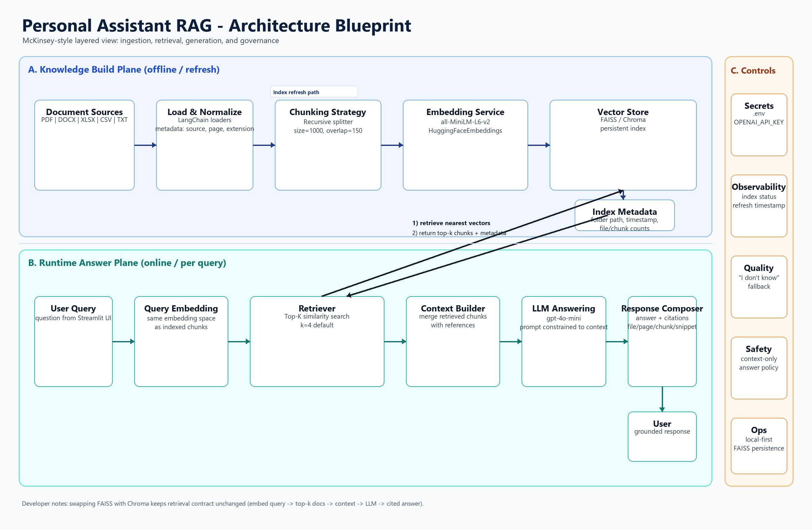

# Personal Assistant RAG (Streamlit + OpenAI)

Personal RAG assistant that ingests your local documents, builds a FAISS vector index, and answers questions with grounded references.

## Use Case and Solution

### Problem
Personal and team documents are spread across different files (PDF, Word, Excel, CSV, TXT). Searching manually is slow and often misses relevant context.

### Solution
This project builds a local retrieval pipeline:
- Ingest supported files recursively from a folder you choose.
- Split content into chunks and generate embeddings locally.
- Store vectors in FAISS for fast semantic retrieval.
- Use `gpt-4o-mini` to answer strictly from retrieved context.
- Return references (`source_file`, `page`, `chunk_id`, snippet) with every response.

### Supported File Types
- `.pdf`
- `.docx`
- `.xlsx`, `.xls`
- `.csv`
- `.txt`

## Architecture Diagram

The primary architecture view below is a McKinsey-style layered blueprint with explicit indexing and runtime paths.  
It highlights the critical retrieval handshake: **query embedding -> retriever top-k similarity search -> vector DB (FAISS/Chroma) -> relevant chunks -> grounded answer**.


## Latest Architecture (Current)

This is the latest architecture view aligned with the current codebase (`main.py` + `langchain_helper.py`):
- User provides a folder path from Streamlit UI.
- Ingestion scans supported files recursively and normalizes metadata.
- Text is chunked and embedded with `all-MiniLM-L6-v2`.
- FAISS stores vectors locally for fast semantic retrieval.
- Query flow uses retriever top-k + `gpt-4o-mini` for grounded answers.
- Output includes references (`source_file`, `page`, `chunk_id`, snippet).



## Technical Stack

- **Frontend/UI:** `streamlit`
- **LLM Orchestration:** `langchain-classic`, `langchain-community`, `langchain-openai`, `langchain-text-splitters`
- **LLM Provider:** OpenAI (`gpt-4o-mini`)
- **Embeddings:** `sentence-transformers` via `HuggingFaceEmbeddings`
- **Vector Store:** `faiss-cpu`
- **Document Parsing:** `pypdf`, `docx2txt`, `unstructured`, `openpyxl`, `CSVLoader`, `TextLoader`
- **Config Management:** `python-dotenv`

## Project Structure

- `main.py` - Streamlit UI and interaction flow (indexing + Q&A).
- `langchain_helper.py` - ingestion, chunking, vector DB, retriever, prompt, and source references.
- `q_and_a.ipynb` - notebook-based experimentation for RAG/Q&A flow.
- `requirements.txt` - Python dependencies.
- `.env` - environment variables (OpenAI API key).
- `faiss_index/` - generated FAISS index and index metadata.

## Step-by-Step Setup and Usage

### 1) Create and activate virtual environment

```bash
python -m venv .venv
.\.venv\Scripts\activate
```

### 2) Install dependencies

```bash
pip install -r requirements.txt
```

### 3) Configure environment variables

Create `.env` in project root:

```env
OPENAI_API_KEY="your_openai_api_key_here"
```

### 4) Prepare your documents folder

Place your files inside a folder (default is `Directory` under project root), e.g.:

```text
Directory/
  finance_report.pdf
  notes.docx
  sales.xlsx
  tickets.csv
  summary.txt
```

### 5) Run the app

```bash
streamlit run main.py
```

### 6) Build/refresh knowledge base

In the UI:
1. Enter your folder path.
2. Click **Build / Refresh Knowledge Base**.
3. Wait for indexing completion and verify **Index Status**.

### 7) Ask questions

Type your question in **Ask your assistant**.  
The app returns:
- concise answer
- supporting references with source file and snippets

## Notes

- If no relevant context is found, the assistant responds with `"I don't know."`.
- Rebuild the knowledge base whenever your document folder changes.
- Index data is stored locally in `faiss_index/`.